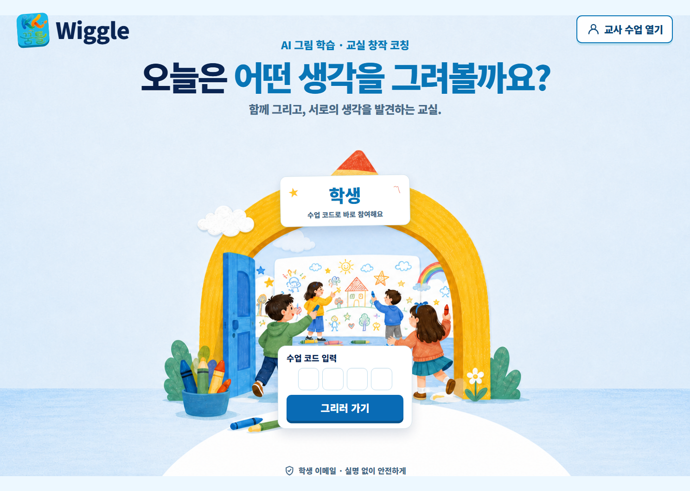
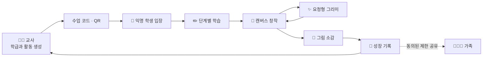
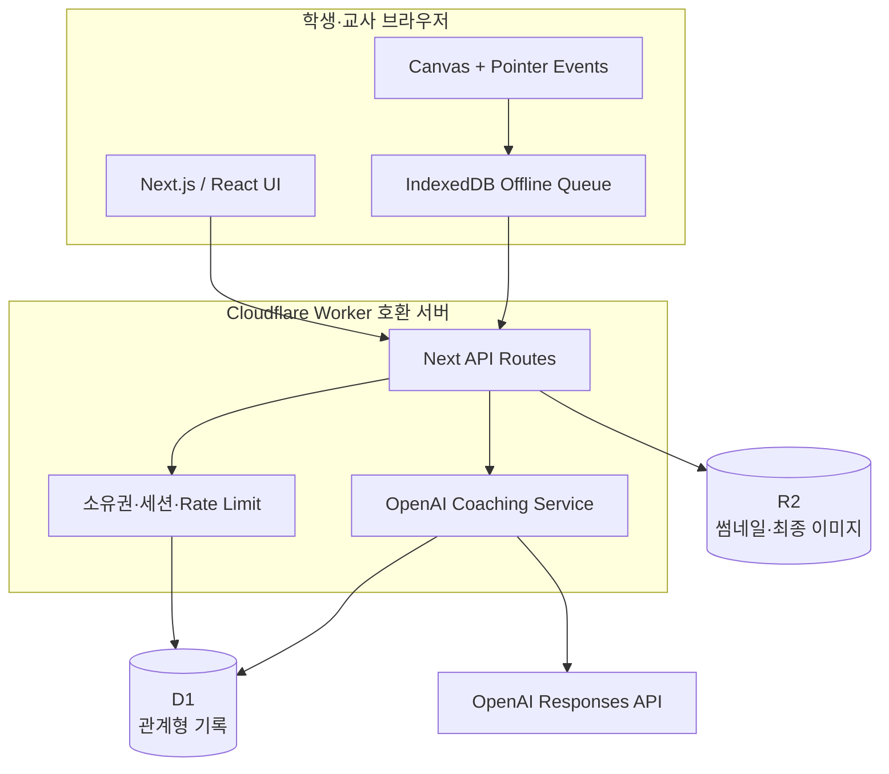
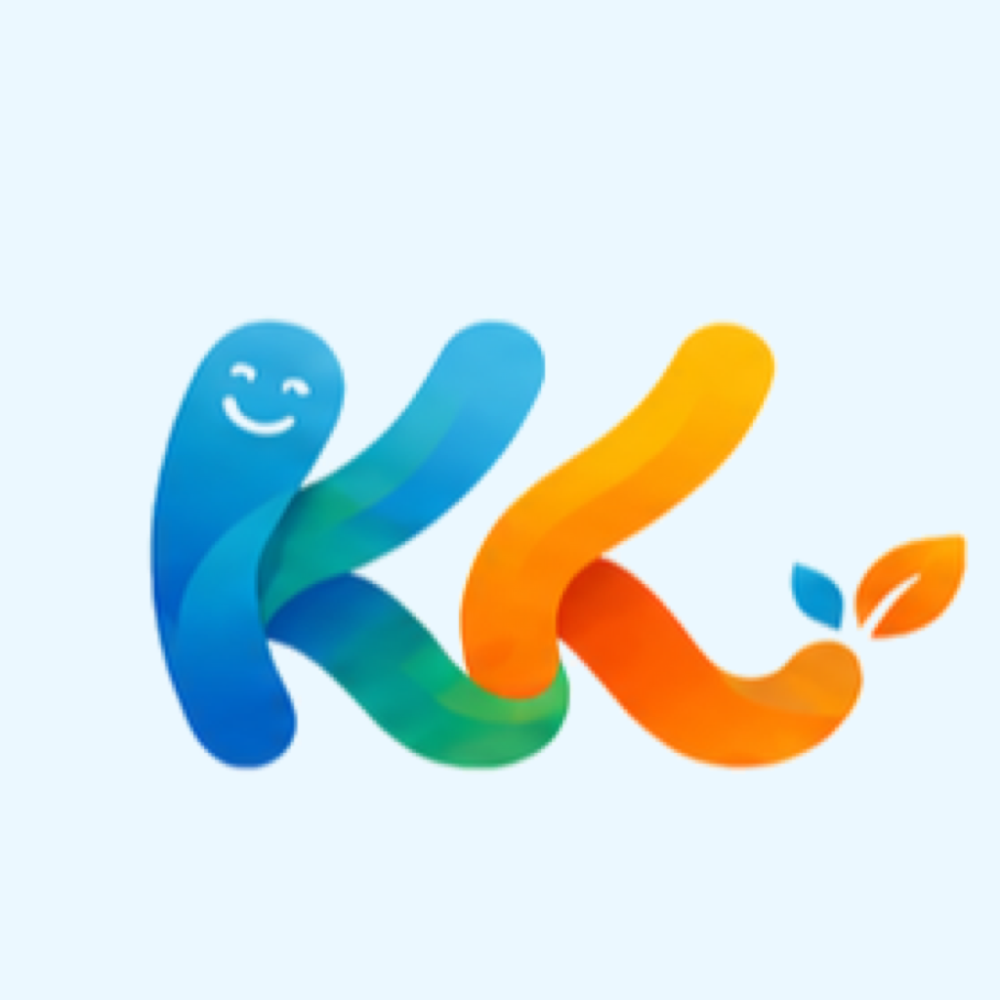

<p align="center">
  
</p>

<h1 align="center">Wiggle Web</h1>

<p align="center">
  <strong>설치 없이 시작하는 초등 저학년 교실용 그림 학습·창작 코칭 웹앱</strong>
</p>

<p align="center">
  기초 선과 도형부터 관찰, 따라 그리기, 자유 창작, 말과 이야기까지.<br />
  아이가 직접 그리고, AI와 교사는 생각을 끌어내는 질문으로 돕습니다.
</p>

<p align="center">
  <a href="https://wiggle-classroom-web.chan1940.chatgpt.site"><strong>개발 프리뷰 열기</strong></a>
  ·
  <a href="#-로컬에서-실행하기">로컬 실행</a>
  ·
  <a href="#-현재-개발-상태">개발 상태</a>
  ·
  <a href="./docs/claude-handoff-2026-07-27.md">개발 인수인계</a>
</p>

<p align="center">
  
  
  
  
  
  
</p>

> [!IMPORTANT]
> Wiggle Web은 현재 **활발히 개발 중인 교육용 프로토타입**입니다. 핵심 기능과 서버 저장은 연결돼 있고 주요 모바일·태블릿 화면도 회귀 검증하지만, 실제 비문해 저학년의 독립 사용성과 학교 운영 적합성은 별도 현장 검증이 필요합니다. 공개 프리뷰는 제품 방향과 기능 확인용입니다.

---

## 🌱 Wiggle Web이란?

Wiggle Web은 단순한 AI 그림 생성기가 아닙니다.

아이가 그림을 못 그렸다고 평가하거나 대신 완성하지 않고, **관찰하고 선택하고 자기 말로 설명하는 과정**을 돕는 교실용 플랫폼입니다. 교사는 학급의 진행을 살피고 필요한 학생에게 메시지나 가이드를 보낼 수 있으며, 작품은 이메일 회원가입 없이 익명 학생 ID에 이어서 저장됩니다.

> **AI 그림 학습 도구 + 교실 창작 코칭 플랫폼**

### 제품이 지키는 원칙

- 🎨 **아이가 직접 그립니다.** AI가 원본 선을 수정하거나 그림을 대신 완성하지 않습니다.
- ✋ **도움은 요청할 때만 옵니다.** 그리미가 자동으로 끼어들지 않습니다.
- 💬 **한 번에 질문 하나만 합니다.** 짧고 쉬운 말과 실제 다음 행동을 제공합니다.
- 🌟 **점수와 순위를 만들지 않습니다.** 창의력 점수, 재능 진단, 또래 순위가 없습니다.
- 🔐 **학생 개인정보를 최소화합니다.** 학생 이메일·실명·학교명을 받지 않습니다.
- 👩‍🏫 **교사가 수업의 중심입니다.** AI는 교사를 대체하지 않고 수업 운영과 개별 코칭을 보조합니다.
- 👨‍👩‍👧 **공개 SNS보다 안전한 공유를 우선합니다.** 가족 공유는 제한 링크와 동의 기록을 전제로 합니다.

## 👥 주요 사용자

| 사용자 | 할 수 있는 일 |
|---|---|
| 🧒 학생 | QR·수업 코드로 입장, 그림 비밀번호 선택, 단계별 학습, 자유 창작, 그리미 호출, 그림 소감 남기기 |
| 👩‍🏫 교사 | 학급·수업 생성, QR 발급, 오늘의 활동 선택, 학생 진행·썸네일 확인, 전체·개별 메시지, 복구 초기화 |
| 👨‍👩‍👧 가족 | 교사와 보호자 동의를 거친 제한 링크로 선택된 작품과 성장 기록 확인 |
| ✨ 그리미 | 아이가 호출했을 때 그림을 보고 질문, 선택지, 바로 그려 볼 다음 행동 제안 |

## 🪜 4단계 그림 교육과정

한 번에 모든 기능을 보여 주기보다 손의 움직임에서 관찰과 창작으로 자연스럽게 확장합니다.

| 단계 | 활동 | 현재 콘텐츠 |
|---|---|---:|
| 1️⃣ 선·도형 기초 | 직선, 곡선, 원, 세모, 네모, 반복 무늬, 도형 조합 | 10개 |
| 2️⃣ 따라 그리기 | 강아지, 고양이, 토끼, 물고기, 자동차, 자전거, 로켓 등 | 10개 |
| 3️⃣ 관찰 그리기 | 한옥, 카피바라, 나무, 달팽이, 우산, 놀이터, 등대 등 | 10개 |
| 4️⃣ 자유 창작 | 아이가 주제를 고르고 필요할 때만 AI 단계 가이드 요청 | 생성형 |

1단계와 따라 그리기 가이드는 다음 순서를 사용합니다.

```text
짧은 연필 시범  →  자석 점선 따라 그리기  →  점선 없이 혼자 그리기
```

점선과 연필 시범은 작품과 분리된 가이드 레이어이므로 아이의 원본 그림과 타임랩스에 포함되지 않습니다.

## ✨ 현재 구현된 기능

### 학생 입장·복구

- 수업 코드와 실제 QR 입장
- 익명 학생 ID 자동 발급
- 별명 추천과 10종 동물 캐릭터 선택
- 반복 가능한 그림 비밀번호 3개
- 한 화면에서 고르는 10종 그림 비밀번호
- 같은 기기 자동 복귀
- 공유 태블릿 학생 선택과 재인증
- 개인 QR 또는 학급 정보 기반 다른 기기 복구
- 중복 별명·동물 프로필 경고

### 터치·스타일러스 캔버스

- ✏️ 연필, 🖍️ 크레용, 마커, 수채화, 채우기, 도형, 네모 지우개, 대칭 그리기
- 아주 얇게부터 아주 굵게까지 5단계 굵기
- 기본색과 밝은색을 합친 24색 팔레트
- 원·세모·네모·별·하트·말풍선 등 10종 도형과 채움 선택
- 되돌리기·다시하기
- pointer 입력 중 즉시 선 표시
- 지우개가 지우는 실제 범위를 보여 주는 네모 커서
- 빠른 Safari 터치에서도 손을 뗀 위치까지 선을 보간
- 점선 위에서 시작하면 안내 경로를 부드럽게 따라가는 자석 가이드
- 정규화된 좌표와 pressure 저장
- D1 자동 저장과 revision 충돌 감지
- IndexedDB 오프라인 저장 큐
- R2 썸네일·최종 이미지
- 작품 완료 버전과 타임랩스
- 완성 예시와 분리된 투명 배경 학습 이미지

### AI 그리미

- 서버에서만 OpenAI API 호출
- 현재 그림 이미지와 구조화된 최근 과정을 함께 사용
- 모르면 단정하지 않고 질문
- 그림 선택지와 짧은 다음 행동
- 아이가 요청한 주제를 6~15단계로 분해
- 최소 두 번의 열린 선택과 마지막 자유 창작
- 질문 전후 그림 버전과 `CoachingEvent` 저장
- 교사용 AI 코칭 문구 초안
- strict JSON schema와 안전 문구 검사

### 교사용 수업 진행실

- 교사 인증과 담당 학급 분리
- 학급 생성·보관, 입장 열기·닫기, 코드 회전
- 30개 활동과 자유 창작 중 오늘의 활동 선택
- 학생 진행 상태와 낮은 빈도의 썸네일 갱신
- 전체 또는 특정 학생에게 텍스트 메시지
- 닫은 선생님 메시지를 다시 확인하는 메시지 이력
- 교사가 보고 있을 때 학생 화면 표시
- 학생 복구 정보 초기화
- 학생 프로필과 연결 세션을 안전하게 보관·복원
- 제한 가족 공유 링크 발급·취소

### 저학년 중심 UI·UX

- 학생 홈의 핵심 메뉴를 `이어 그리기 → 내 그림 → 활동 고르기` 순서로 단순화
- 수업 마치기는 일반 활동 메뉴와 분리
- 중요한 안내마다 누르면 듣는 음성 버튼 제공
- 도구는 글자가 없어도 알아볼 수 있는 큰 그림 아이콘 중심으로 표시
- 데스크톱·태블릿·모바일·가로 화면마다 안내와 캔버스가 겹치지 않는 반응형 배치
- 긴 문장은 짧은 행동 문구로 바꾸고 단어 단위 줄바꿈 적용
- 고양이 색상 같은 선택은 실제 도구·색상 설정과 연결하고 화면에 선택 결과를 표시

### 기능 플래그 뒤의 기반 기능

| 기능 | 기본값 | 상태 |
|---|---:|---|
| 특정 학생 음성 귓속말 | `false` | API·검증·UI 기반 구현, 실제 교실 환경 검증 필요 |
| 구독 entitlement/webhook | `false` | schema·이벤트 순서·검증 기반 구현, 결제 제공자 연결 필요 |
| 가족 제한 공유 | 동의 필요 | 제한 세션·작품 범위·만료·취소 기반 구현 |

## 🔄 대표 사용자 흐름



## 🏗️ 시스템 구조



### 데이터 저장 원칙

- **D1:** 교사, 학급, 익명 학생, 세션, 작품 동작, 버전, 코칭 사건, 소감, 메시지, 가족 공유
- **R2:** 학생 썸네일, AI 코칭 전후 이미지, 최종 이미지
- **브라우저:** 짧은 활성 세션, 공유 태블릿 프로필 카드, 전송 전 오프라인 큐
- **서버 전용:** OpenAI API 키와 AI 요청

## 🔐 개인정보와 보안

- 학생 이메일·실명·출생연도·학교명 미수집
- 원본 device token과 개인 QR token 대신 SHA-256 해시 저장
- 그림 비밀번호와 로컬 교사 PIN은 개인 salt를 사용한 PBKDF2-SHA256 100,000회
- 학생 작품 요청마다 device session의 student ID 소유권 확인
- 교사 요청마다 담당 학급 소유권 확인
- 학급 코드와 QR만으로 학생 목록이나 작품 열람 불가
- 작품 저장 revision CAS와 요청 멱등성
- 같은 출처 교사 쓰기와 `SameSite=Strict` 쿠키
- 학생·교사·AI 요청별 rate limit
- 전체 채팅 원문 대신 제품에 필요한 구조화 사건만 저장

자세한 내용은 [보안·데이터 모델](./docs/security-data-model.md)을 참고하세요.

## 🧭 화면 경로

| 경로 | 화면 |
|---|---|
| `/` | 제품 소개와 학생·교사 역할 선택 |
| `/join` | 수업 코드 입력, 공유 태블릿 학생 선택 |
| `/join/:token` | QR·토큰 입장 |
| `/join/recover` | 개인 QR 복구 |
| `/student` | 학생 홈과 오늘의 추천 |
| `/student/practice` | 1단계 선·도형 |
| `/student/guided` | 2단계 따라 그리기 |
| `/student/observe` | 3단계 관찰 그리기 |
| `/student/draw/:id` | 캔버스와 그리미 |
| `/student/archive` | 작품·성장 기록 |
| `/teacher` | 교사 홈과 학급 관리 |
| `/teacher/class/:id` | 수업 진행실 |
| `/family/:token` | 가족 제한 링크 진입 |
| `/family/view` | 허용된 가족 작품 보기 |

## 🚀 로컬에서 실행하기

### 요구 사항

- Node.js `22.13` 이상
- npm
- 로컬 AI 코칭을 시험하려면 OpenAI API 키

### 1. 저장소 받기

```powershell
git clone https://github.com/yonghwan86/wiggle_web.git
cd wiggle_web
npm.cmd ci
```

### 2. 환경 변수 준비

```powershell
Copy-Item .env.example .env.local
```

`.env.local`에 필요한 값을 입력합니다.

```dotenv
OPENAI_API_KEY=your_api_key_here
OPENAI_MODEL=gpt-5.6-sol
WIGGLE_VOICE_WHISPER_ENABLED=false
WIGGLE_SUBSCRIPTIONS_ENABLED=false
```

> [!CAUTION]
> `.env.local`과 실제 API 키는 Git에 커밋하지 마세요. 브라우저 코드에 `OPENAI_API_KEY`를 사용하지 않습니다.

### 3. 로컬 데이터베이스와 개발 서버

```powershell
npm.cmd run db:local:init
npm.cmd run dev
```

개발 서버가 출력하는 Local URL을 엽니다.

### 로컬 교사 로그인

로컬 개발 환경에서 처음 입력한 이메일과 **8자 이상 PIN**으로 개발 전용 교사 계정을 만듭니다.

- `NODE_ENV`가 production이 아님
- 요청 호스트가 `localhost`, `127.0.0.1`, `[::1]` 중 하나

위 조건에서만 로컬 로그인이 열립니다. 운영 교사 화면은 Sites가 전달하는 ChatGPT 인증 사용자를 요구합니다.

## ✅ 검증하기

```powershell
npm.cmd run typecheck
npm.cmd run lint
npm.cmd test
git diff --check
```

`npm.cmd test`는 production build 뒤 전체 Node 테스트를 실행합니다.

현재 기준:

```text
162 tests
162 passed
0 failed
```

실제 브라우저 행동 검증은 별도 명령입니다. 로컬 서버를 띄운 뒤 실행하면 headless Chrome을 CDP로 몰아 `320×568`, `390×844`, `844×390`에서 computed size, 가로 스크롤, 가려진 버튼, 모달 초점, 그리미 시트 스크롤을 실제 DOM으로 측정합니다.

```powershell
npm.cmd run dev            # 별도 창
npm.cmd run check:browser
```

> [!WARNING]
> 자동 테스트 통과는 실제 저학년 UX 통과를 의미하지 않습니다. `check:browser`는 실측이지만 headless 환경이며, 실기기(iPad Safari·Android Chrome)와 실제 아동 관찰을 대신하지 못합니다.

### 모바일 필수 확인 크기

- `320 × 568` 세로
- `390 × 844` 세로
- `844 × 390` 가로
- 가능하면 실제 iPad Safari와 Android Chrome

## 🗃️ 데이터베이스 변경

schema는 [`db/schema.ts`](./db/schema.ts), migration은 [`drizzle/`](./drizzle)에 있습니다.

```powershell
npm.cmd run db:generate
```

새 migration을 생성한 뒤 반드시 SQL을 검토합니다. D1 schema 변경 없이 migration 파일만 임의 수정하지 않습니다.

## ☁️ 배포

현재 앱은 **ChatGPT Sites**에 연결돼 있습니다.

```json
{
  "d1": "DB",
  "r2": "ARTWORKS"
}
```

- `.openai/hosting.json`의 기존 프로젝트 ID를 유지합니다.
- D1과 R2는 논리 바인딩 이름만 저장소에 둡니다.
- 운영 환경 변수는 Sites에서 관리합니다.
- 검증된 정확한 Git commit에서 Sites version을 만들고 production에 배포합니다.
- 다른 호스팅으로 이전할 때는 D1, R2, 교사 인증, 환경 변수와 migration 전략을 함께 다시 설계해야 합니다.

## 📁 프로젝트 구조

```text
wiggle_web/
├─ app/
│  ├─ api/                    # 학생·교사·작품·AI·가족·구독 API
│  ├─ components/             # 입장, 홈, 캔버스, 교사실, 가족 화면
│  ├─ student/                # 학생 화면 라우트
│  ├─ teacher/                # 교사 화면 라우트
│  └─ family/                 # 가족 제한 공유 라우트
├─ db/
│  ├─ schema.ts               # D1 schema
│  └─ runtime.ts              # runtime binding
├─ drizzle/                   # D1 migrations
├─ lib/
│  ├─ lesson-content.ts       # 30개 교육 콘텐츠
│  ├─ drawing-model.ts        # DrawDoc / DrawOp
│  ├─ trace-guidance.mjs      # 점선 자석 추적과 경로 보간
│  ├─ openai-coaching.ts      # AI schema·prompt·validation
│  ├─ security.ts             # 세션·검증·rate limit
│  └─ client-session.ts       # 기기 세션·오프라인 큐
├─ public/brand/              # 로고와 앱 아이콘
├─ public/lessons/            # 따라 그리기·관찰 그리기 참고 이미지
├─ tests/                     # 계약·보안·저장·UX 회귀 테스트
├─ worker/                    # Cloudflare Worker 진입점
├─ docs/                      # 구조·보안·UX·인수인계 문서
├─ CLAUDE.md                  # Claude Code 상시 작업 규칙
└─ .openai/hosting.json       # 기존 Sites 프로젝트와 논리 바인딩
```

## 📊 현재 개발 상태

| 영역 | 상태 | 비고 |
|---|---|---|
| MVP 1 교실 입장·캔버스·저장 | ✅ 구현 | 실제 학교 운영 정책 검토 필요 |
| 30개 4단계 교육과정 | ✅ 구현 | 10개 기초·10개 따라 그리기·10개 관찰 그리기 |
| 연필 시범·자석 점선·독립 그리기 | ✅ 구현 | 가이드는 원본 그림·타임랩스와 분리 |
| 저학년용 캔버스 도구 | ✅ 구현 | 8개 도구·5개 굵기·24색·10개 도형 |
| AI 이미지 코칭·단계 가이드 | ✅ 구현 | 실제 아동 안전성·비용 검증 필요 |
| 질문 전후 버전·성장 기록 | ✅ 구현 | 장기 리포트 표현 개선 필요 |
| 가족 제한 공유 | 🟡 기반 구현 | 보호자 동의 운영 절차 필요 |
| 음성 귓속말 | 🟡 플래그 뒤 구현 | 교실 소음·이어폰·기기 테스트 필요 |
| 구독 | 🟡 데이터 기반 구현 | 결제 제공자와 상품 정책 미연결 |
| 실제 비문해 저학년 UX | 🟡 현장 검증 전 | 자동·다중 해상도 검증 완료, 실제 아동 관찰 필요 |
| 공개 SNS·순위·재능 점수 | ⛔ 비대상 | 제품 원칙상 초기 구현하지 않음 |

### 다음 검증 우선순위

1. 실제 iPad Safari·Android Chrome에서 스타일러스 지연과 장시간 자동 저장 검증
2. 글을 아직 읽지 못하는 1~2학년이 설명 없이 입장·그리기·지우기·완료할 수 있는지 관찰
3. 30개 활동의 단계 난이도와 완성 예시를 초등 미술 교사가 검토
4. 교실의 느린 네트워크와 공유 태블릿 다중 학생 전환을 장시간 검증
5. 실제 학교 운영 전 개인정보 보존 기간·보호자 동의·교사 권한 정책 확정

상세 구조와 운영 경계는 [개발 인수인계](./docs/claude-handoff-2026-07-27.md), [보안·데이터 모델](./docs/security-data-model.md), [UX·시장 감사](./docs/ux-market-audit-2026-07.md)에 정리돼 있습니다.

## 🧪 실제 아동 검증 기준

보호자 동의 아래 1~2학년 5명 이상에게 설명 없이 다음 과제를 수행하게 합니다.

- QR로 입장
- 연필로 첫 선 긋기
- 굵은 지우개로 일부 지우기
- 연필 시범과 점선으로 한 단계 완료
- 그리미 호출과 거절
- 그림 선택으로 소감 완료
- 틀린 그림 비밀번호에서 다시 복구

성공 기준:

- 핵심 과제 80% 이상 완료
- 과제당 중립적 힌트 1회 이하
- 치명적 데이터 손실 0건
- 오류 뒤 한 번의 분명한 행동으로 복구

## 🤝 개발·검증 협업

이 저장소는 구현과 검증을 분리합니다.

```text
개발 에이전트
  → 기능 브랜치에서 구현
  → 자동·브라우저 테스트
  → 커밋 SHA와 남은 위험 보고

독립 검증 에이전트
  → 설명을 정답으로 삼지 않고 재현
  → 보안·모바일·오류 흐름 공격적 검사
  → GO일 때만 main 반영과 Sites 배포
```

Claude Code는 루트 [`CLAUDE.md`](./CLAUDE.md)를 먼저 읽고, 상세 상태는 [개발 인수인계 문서](./docs/claude-handoff-2026-07-27.md)를 따릅니다.

## 📚 문서

- [MVP 1 데이터·권한·복구 구조](./docs/architecture-mvp1.md)
- [보안·데이터 모델](./docs/security-data-model.md)
- [Flutter 참고 자료 이식 감사](./docs/flutter-adoption-audit.md)
- [저학년 UX·시장 점검](./docs/ux-market-audit-2026-07.md)
- [편집 기능·Excalidraw 제한 도입 계획](./docs/editor-roadmap.md)
- [Claude 개발 인수인계](./docs/claude-handoff-2026-07-27.md)
- [Claude → Codex 자동 검증·배포 파이프라인](./docs/agent-pipeline.md)
- [브랜드 자산 manifest](./public/brand/asset-manifest.json)

### 캔버스 짧은 글씨

학생은 그림 위에 이름표·제목·말풍선을 넣고, 도화지에서 위치를 고르거나 빈 곳 추천을 요청할 수 있습니다. 글씨는 끌어서 이동하고 내용·크기·색을 바꾸거나 삭제할 수 있으며, 모든 변경은 원본 그림과 함께 자동 저장·썸네일·최종 PNG·타임랩스에 반영됩니다. Excalidraw는 이 핵심 학생 캔버스에 포함하지 않으며, 추후 교사용 참고 자료 편집과 비파괴 공유 카드 구성에만 제한적으로 검토합니다.

## 🧩 Flutter 프로젝트와의 관계

기존 Flutter 저장소 `wiggle_draw`는 읽기 전용 제품 참고 자료입니다.

- Flutter UI·내비게이션·파일 저장 코드를 복사하지 않습니다.
- 검증된 DrawDoc·DrawOp 개념, 캔버스 규칙, AI 안전 원칙, 브랜드 자산만 선별 이식했습니다.
- 두 프로젝트는 Git 이력, 빌드, 배포가 완전히 독립적입니다.

## 📄 라이선스

현재 저장소에는 별도 `LICENSE` 파일이 없습니다. 소스 사용·재배포·상업적 이용 권한은 저장소 소유자에게 확인해 주세요.

---

<p align="center">
  
</p>

<p align="center">
  <strong>그림으로 생각하고, 말로 자라요.</strong><br />
  아이의 선을 대신하지 않는 그림 학습 플랫폼을 만들어 갑니다.
</p>
